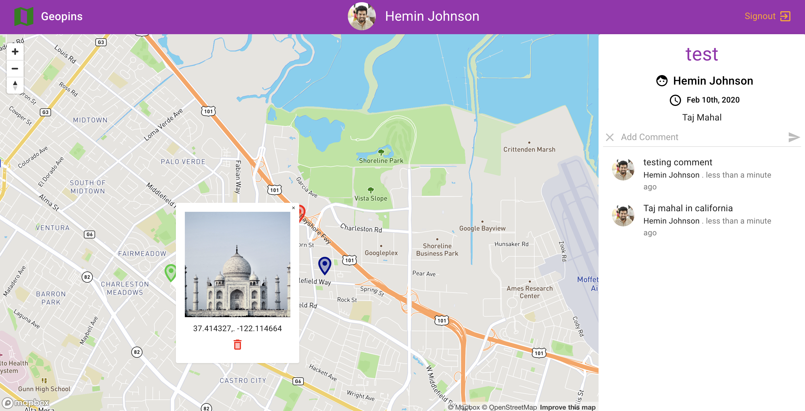

# react-graphql-geopins-app

## Overview

Full-stack React app with GraphQL Server on the backend, Cloud MongoDB database (Mongo Atlas) with React 
Hooks to manage our state (replacing Redux!), with Social Authentication (Google OAuth2), 
GraphQL Subscriptions, image uploads with Cloudinary and more.

This application will be a live geolocation app where users can 'pin' different locations on the map and 
share their content with other users in realtime to share pictures, reviews of the location and area, 
add comments to their pins, and manage the pins they've created.

## Installation for Backend

Clone this repository and run

```javascript
npm install
```

To start server

```javascript
npm run dev
```

## ENVIRONMENT VARIABLES

Keys and other sensitive details are not stored on Github. Before starting the app create a `.env` file and add the API KEY:

`MONGO_URI=[YOUR_MONGO_DB_CONNECTION_STRING]`<br/>
`OAUTH_CLIENT_ID=[YOUR_AUTHORIZATION_ID_FROM_GOOGLE_OAUTH]`

## Installation for Client

Navigate to client directory and run

```javascript
npm install
```

To start client

```javascript
npm run start
```

## ENVIRONMENT VARIABLES

Keys and other sensitive details are not stored on Github. Before starting the app create a `.env.development.local` file and add the API KEY:

`REACT_APP_OAUTH_CLIENT_ID=[YOUR_AUTHORIZATION_ID_FROM_GOOGLE_OAUTH]`<br/>
`REACT_APP_MAP_API_ACCESS_TOKEN=[YOUR_GOOGLE_MAPS_API_KEY]`<br/>
`REACT_APP_CLOUDINARY_UPLOAD_PRESET=[YOUR_CLOUDINARY_UPLOAD_PRESET]`<br/>
`REACT_APP_CLOUDINARY_CLOUD_NAME=[YOUR_CLOUDINARY_CLOUD_NAME]`

### View [working demo](https://react-graphql-geopins-app.now.sh)

> Note: This app is hosted on Heroku free tier.  If currently in 'sleep mode' the initial request time may take longer. 
> Subsequent requests will perform normally.

<br>


